1. This project is a web-based Markdown to PDF converter application. It allows users to:

- Upload or write Markdown content directly in the browser

- Preview the formatted HTML version

- Convert the content into a styled PDF using a chosen theme

- The application is built using Python and Flask on the backend, and uses marked.js for rendering Markdown in the browser. The PDF generation is handled via WeasyPrint.

- To ensure portability, scalability, and automation, the project is containerized with Docker, deployed to Google Kubernetes Engine (GKE), and uses GitHub Actions for CI/CD workflows.

2. Technology Stack

Backend:

- Python 3.11: Core programming language

- Flask: Lightweight web framework

- WeasyPrint: For generating PDFs from HTML/CSS

Frontend:

- HTML5 & CSS3: UI structure and styling

- JavaScript + marked.js: Markdown parsing and preview rendering

DevOps & Infrastructure:

- Docker: For packaging the application

- GitHub Actions: CI/CD automation pipeline 

- Google Cloud Platform:

- Artifact Registry: Docker image storage

- GKE (Google Kubernetes Engine): Hosting the application

- Cloud Build: Image building & deployment via triggers

3. Local Development Setup

Step 1: Clone the Repository

-- git clone https://github.com/your-username/md2pdf-converter.git -- 
-- cd md2pdf-converter --

Step 2: Set Up Virtual Environment

-- python3 -m venv venv --
-- source venv/bin/activate --

Step 3: Install Dependencies

-- pip install -r requirements.txt --

Step 4: Run the Application

-- python app.py --

Visit http://localhost:5000 in your browser.

4. Docker Setup

I started with creating a Dockerfile and adding below lines:

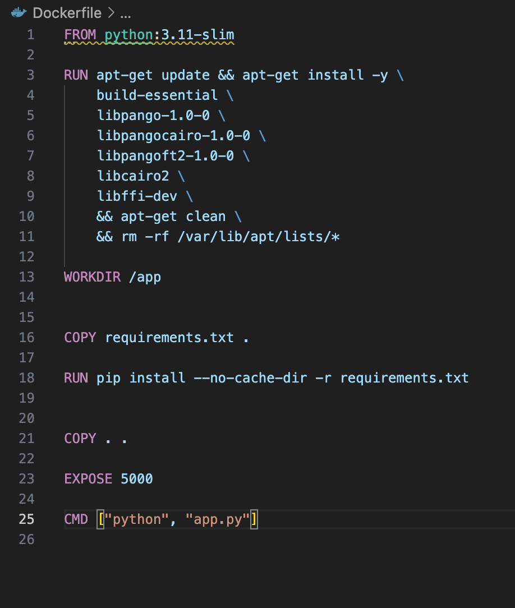

Then I ran the below command :

-- docker build -t md2pdf-app . --

And finally:

-- docker run -p 5000:5000 md2pdf-app --

This exposes the application locally via Docker.

5. Kubernetes Deployment on Google Cloud

I strted with creating a cluster :

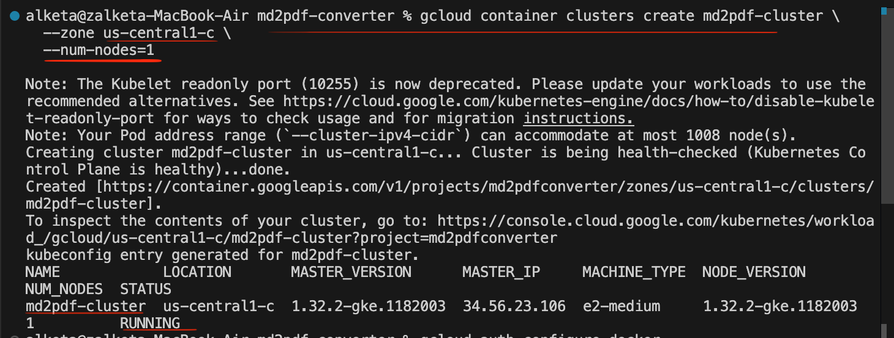

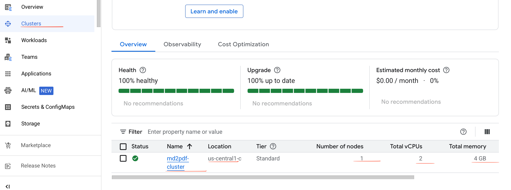

Then I created the needed yaml files:

1.deployment.yaml:

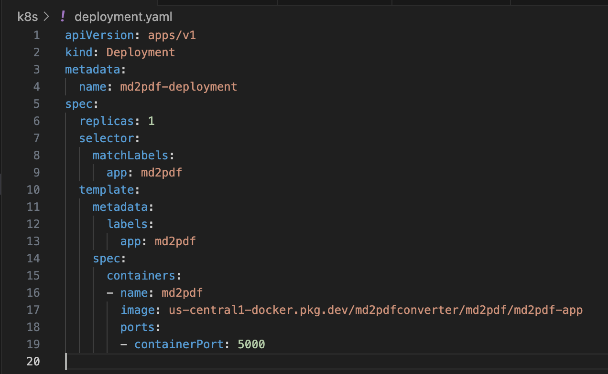

2.service.yaml

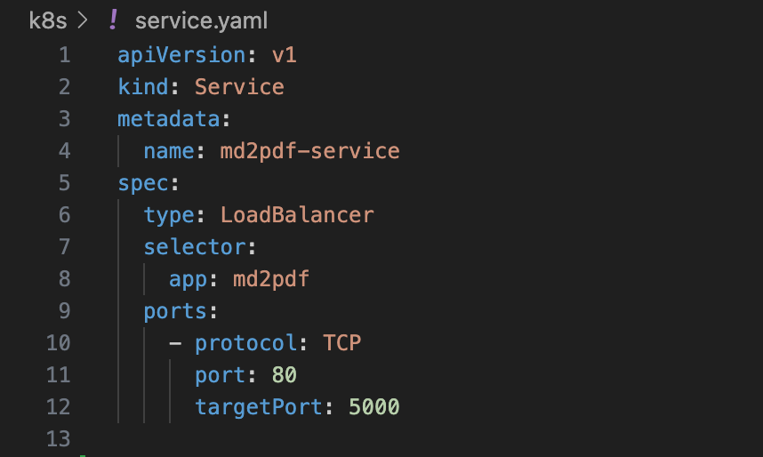

6. GitHub Actions CI/CD Pipeline

Goal was to:

Automatically build, push Docker image, and deploy to GKE on every push to main branch.

I started by creating Workflow Structure (.github/workflows/deploy.yml):

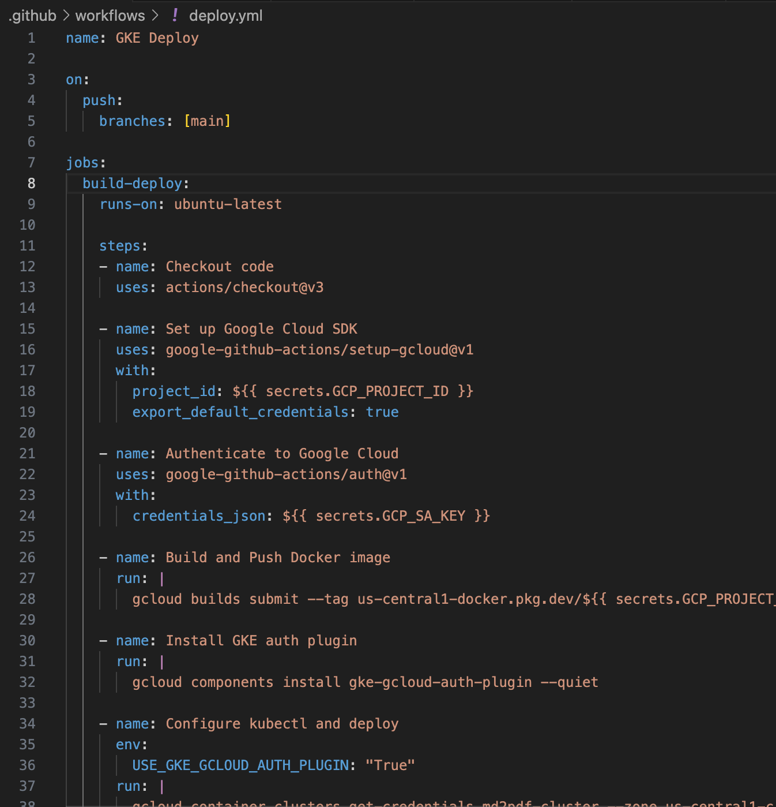

This code will:

Set up gcloud CLI

Authenticate using service account

Build & push Docker image

Deploy to GKE

I added the GitHub Secret

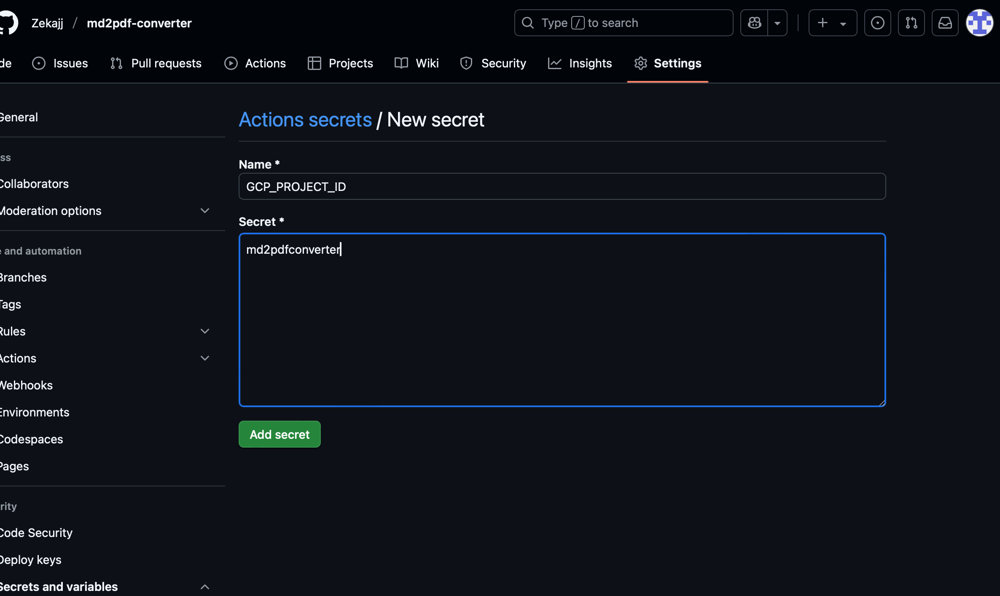

I generated a JSON key of GCP service account encoded in base64 and added to GitHub Secrets

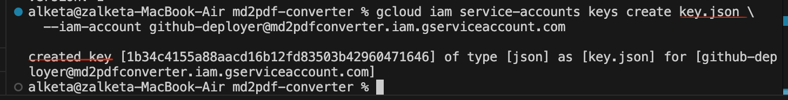

Finally I pushed everything to GitHub and if we wait we can see that our workflow is created :

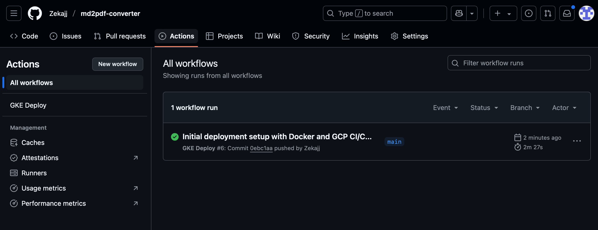

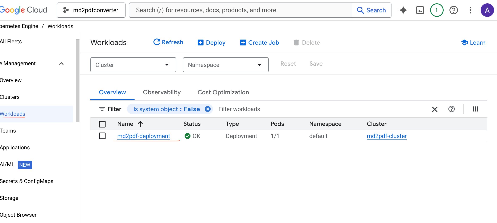

The project is exposed now using a LoadBalancer

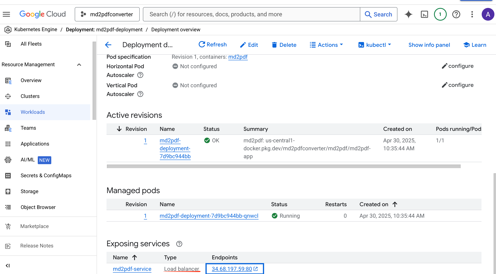

Here we can see our build history:

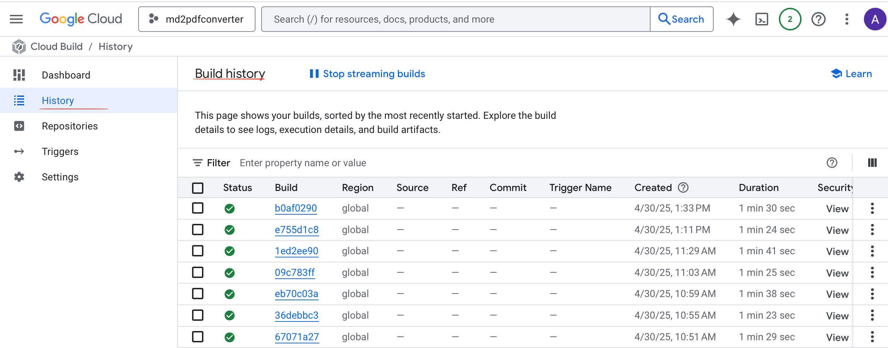

8. Improvements and Future Work

- Store generated PDFs for users

- Add login/authentication and history

- Theme editor for PDF

- Support exporting to DOCX

9. Summary

This project demonstrates full-stack web app development combined with DevOps best practices:

- Responsive Markdown UI

- Dynamic PDF rendering

- Cloud-native deployment with Kubernetes

- CI/CD automation

10. Project demonstration: Functionality and appearance

Light mode:
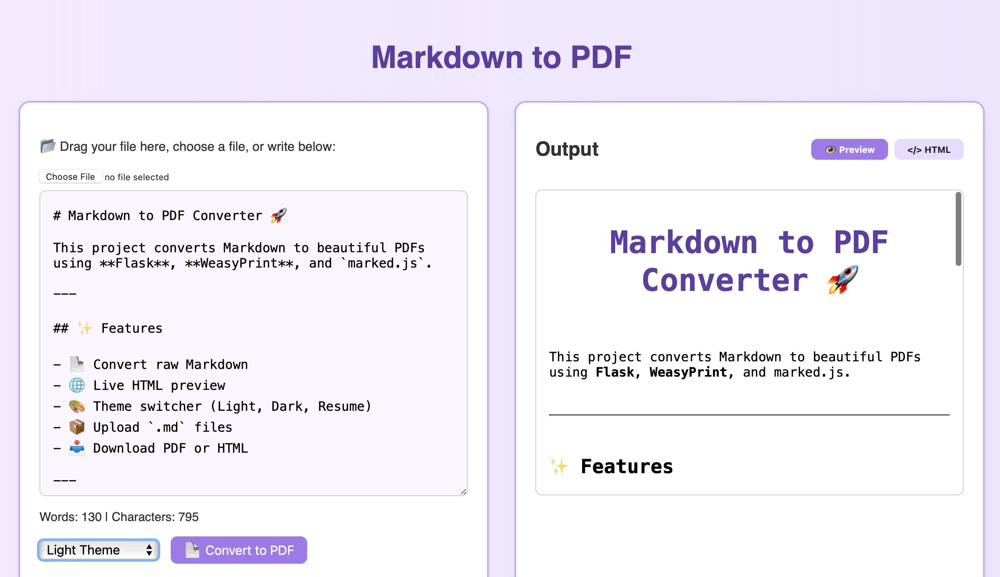

Dark mode:

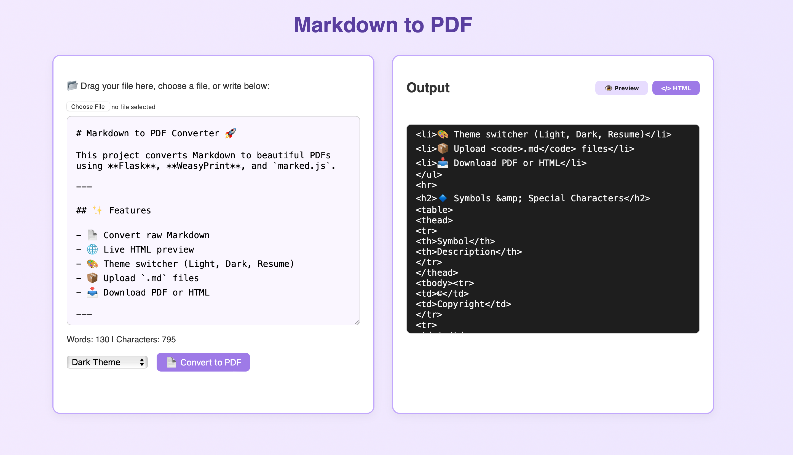

HTML preview:

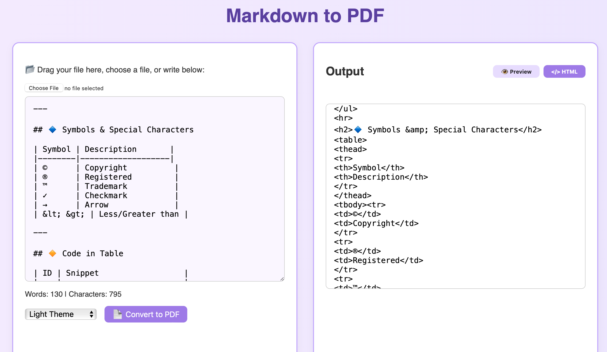

